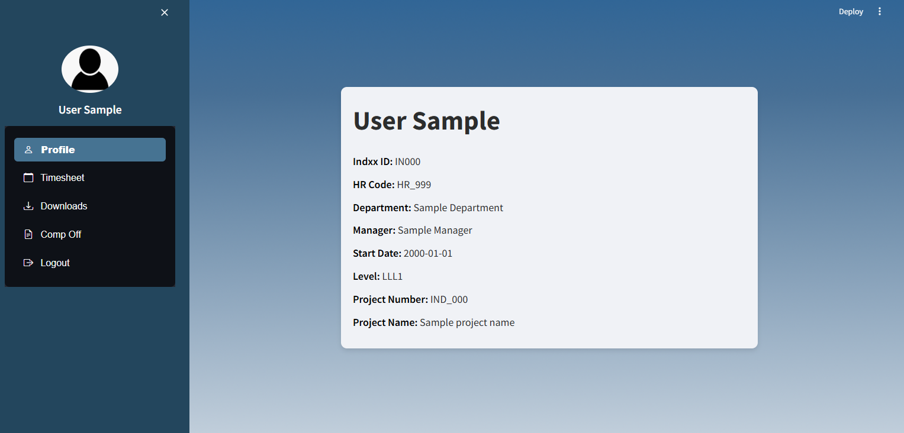

# Timesheet-Management

Timesheet Management is a modern timesheet and worklog management system designed for efficient employee time tracking and administrative tasks.

## Key Features

- **Secure Login**: User authentication and access control.
- **Intuitive UI**: Easy navigation with sidebar menus for users and admins.
- **Timesheet Management**: Fill, view, and download timesheets.
- **Admin Capabilities**: Freeze/unfreeze timesheets, monitor status, and manage user roles.
